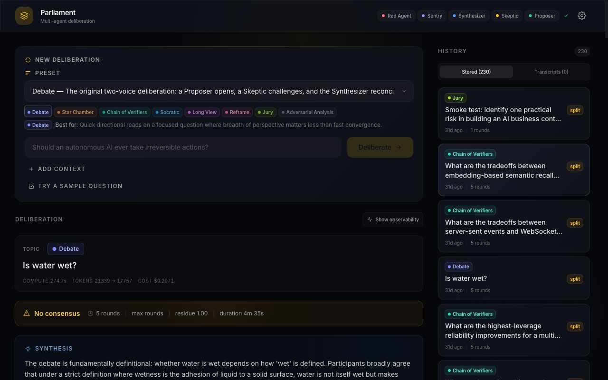
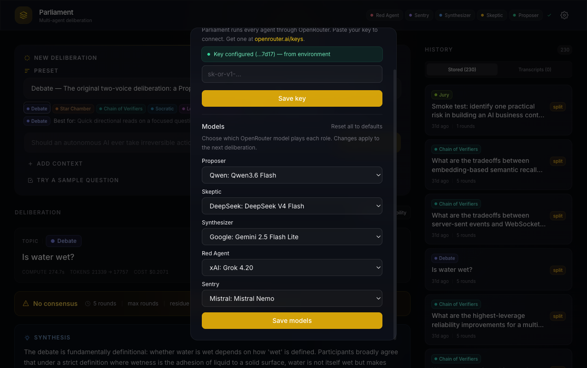
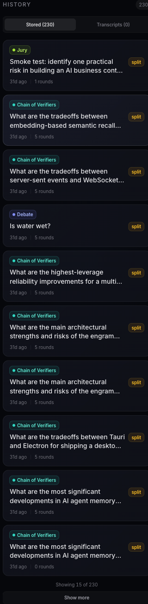

# Parliament

[](https://github.com/heybeaux/parliament/actions/workflows/ci.yml)
[](https://github.com/heybeaux/parliament/releases/tag/v0.2.2-desktop)

Parliament is a multi-model **synthetic discourse engine**. Instead of asking one model for one answer, it convenes a panel of AI agents — each running on a different model via [OpenRouter](https://openrouter.ai) (or a local provider) — that deliberate a topic on a shared blackboard until they reach consensus, surface an irreconcilable split, or hit a round limit. The engine injects adversarial critique on a schedule, monitors for echo loops, scores unresolved conflict, and persists every transcript.



## The agents

A default deliberation seats five agents:

| Agent           | Role                                                                    |
| --------------- | ----------------------------------------------------------------------- |
| **Proposer**    | Opens with a clear, well-reasoned initial position                      |
| **Skeptic**     | Challenges assumptions, identifies logical gaps                         |
| **Synthesizer** | Reconciles conflicts into a unified view — or marks the split as irreconcilable |
| **Red Agent**   | Adversarial injection every N rounds to disrupt premature consensus     |
| **Sentry**      | Echo-loop and convergence monitor; can terminate a collapsing debate    |

Each agent runs on its own model, so a debate is genuinely multi-model — e.g. Qwen proposing, DeepSeek critiquing, Gemini synthesizing, Grok disrupting. Beyond the default cast, thirteen built-in **neurotypes** (Empiricist, Steelmanner, Devil's Advocate, Historian, Forecaster, Lateralist, Translator, …) can be composed into different debate shapes via **topology presets** — see [Presets](#presets), [docs/neurotypes.md](docs/neurotypes.md), and [docs/topology.md](docs/topology.md).

The engine tracks an Opinion Shift Index (OSI) per agent to detect echo loops, weights unresolved conflicts into a residue score, and stores every deliberation in SQLite behind a REST API.

## Desktop app (macOS)

Parliament ships as a signed and notarized macOS desktop app — a Tauri shell that bundles the UI and a sidecar server on `localhost:3000`. No Node, pnpm, or TOML editing required.

1. Download the DMG from the [v0.2.2-desktop release](https://github.com/heybeaux/parliament/releases/tag/v0.2.2-desktop).
2. Drag Parliament to Applications and launch it.
3. Open **Settings**, paste an OpenRouter API key ([get one here](https://openrouter.ai/keys)), and deliberate.

The bundled default models are cheap and fast — a 3-round debate clears well under $0.05:

| Role        | Default model                  |
| ----------- | ------------------------------ |
| Proposer    | `qwen/qwen3.6-flash`           |
| Skeptic     | `deepseek/deepseek-v4-flash`   |
| Synthesizer | `google/gemini-2.5-flash-lite` |
| Red Agent   | `x-ai/grok-4.20`               |
| Sentry      | `mistralai/mistral-nemo`       |

### Per-agent model picker

Every role's model can be swapped from **Settings → Models**, backed by the live OpenRouter catalog (proxied through `GET /models`). Changes persist to `~/.parliament/settings.json` and apply to the next deliberation — no environment variables or config-file edits needed.



### Deliberation history

The history panel lists every stored deliberation with its preset and outcome, paginated 15 at a time.



## Quickstart (development)

Requires Node 20+ and pnpm 10 (pinned via the `packageManager` field — `corepack enable` picks it up automatically).

```bash
git clone https://github.com/heybeaux/parliament.git
cd parliament
pnpm install
pnpm build          # tsc project references: core, server, cli
```

Run the server (REST API on port 3000 by default):

```bash
node packages/server/dist/index.js
```

Run the web UI (Vite dev server on port 5173, proxies `/api` to the server — override the target with `PARLIAMENT_SERVER`):

```bash
pnpm --filter @parliament/ui dev
```

Run a deliberation from the CLI:

```bash
node packages/cli/dist/index.js deliberate "Should we adopt a four-day work week?"

# Pick a different debate shape for this run:
node packages/cli/dist/index.js deliberate --preset jury "Should we adopt a four-day work week?"
```

The CLI is exposed as `parliament` once published; until then invoke the built entry directly.

## Configuration

### OpenRouter API key

The easiest path is the **Settings panel** in the UI — paste your key once and it's stored in `~/.parliament/settings.json`. The `OPENROUTER_API_KEY` environment variable also works and takes precedence for power users. A missing key throws a clear startup error naming the variable, not a 401 mid-deliberation.

### Models

Pick per-agent models in **Settings → Models** (see above). For headless setups, per-neurotype `model` / `provider` overrides live in `parliament.toml`.

### `parliament.toml`

Engine-level configuration lives in `parliament.toml` at the repository root. The loader reads from `process.cwd()`; override the path with `PARLIAMENT_CONFIG=/path/to/config.toml` or `--config <path>` on the CLI. The desktop app ships with `parliament.desktop.toml`, which runs every role on OpenRouter.

```toml
[parliament]
max_rounds            = 5      # forced termination round
confidence_threshold  = 0.7    # synthesizer score required for consensus
red_agent_interval    = 2      # inject the disruptor every N rounds
osi_enabled           = true   # echo-loop detection on per-role transcripts
server_port           = 3000   # REST server port

# Default deliberation shape (override per-run via --preset or the request body)
[topology]
active = "debate"

# Per-neurotype model / provider / prompt overrides
[neurotypes.skeptic]
provider = "openrouter"
model    = "deepseek/deepseek-v4-flash"
```

### Providers

OpenRouter is the primary provider, but the adapter layer also supports local backends — set `provider` per neurotype (or `PARLIAMENT_PROVIDER` globally) to `openrouter`, `ollama`, `lm_studio`, or `omlx`.

## Presets

Topology presets compose neurotypes into reusable deliberation shapes. Pick one with `--preset <id>` (CLI), `preset` in the `POST /deliberate` body, the preset picker in the UI, or `[topology].active` in `parliament.toml`. Rationale and parallel-step semantics live in [docs/topology.md](docs/topology.md).

| Preset               | Shape                                                              | Pick when                                                                              |
| -------------------- | ------------------------------------------------------------------ | --------------------------------------------------------------------------------------- |
| `debate`             | Proposer → Skeptic                                                 | Quick directional reads on a focused question. The default.                             |
| `star-chamber`       | Proposer → Skeptic → Devil's Advocate → Empiricist                 | Sequential interrogation — each critic builds on the prior one's framing.               |
| `chain-of-verifiers` | Proposer → Empiricist → Steelmanner → Skeptic                      | Claim-checking pipelines where each step verifies the prior turn.                       |
| `socratic`           | Translator → Empiricist → Skeptic                                  | Surfacing hidden assumptions before stress-testing them.                                |
| `long-view`          | Historian → Proposer → Forecaster → Pragmatist                     | Decisions whose consequences play out over years.                                       |
| `reframe`            | Lateralist → Translator → Steelmanner                              | Stuck framings — forces a structural shift before anyone defends a position.            |
| `jury`               | Proposer, then four critics **in parallel**                        | Avoiding first-speaker order bias — critics fire concurrently against one snapshot.     |
| `adversarial`        | Proposer → Adversary → Empiricist → Pragmatist                     | Failure-mode-first review of a feature or decision — assumes it ships, asks what breaks. |

User-defined presets are authored under `[topology.presets.<id>]` in `parliament.toml` and show up in the UI picker alongside the built-ins.

## REST API

The server binds to `[parliament].server_port` (default 3000, `PORT` env override) on loopback by default. All routes are mounted at both `/` and `/api` (the UI and desktop webview use the `/api` prefix).

| Endpoint                    | Description                                                        |
| --------------------------- | ------------------------------------------------------------------ |
| `POST /deliberate`          | Run a deliberation. Body: `{ topic, preset?, config? }`.           |
| `GET  /deliberate/:id`      | Fetch a stored deliberation.                                       |
| `GET  /deliberate/:id/stream` | SSE stream of live turns.                                        |
| `GET  /deliberations`       | Paginated list of stored deliberations.                            |
| `GET  /presets`             | Topology preset registry plus the active default.                  |
| `GET  /models`              | Proxied OpenRouter model catalog (feeds the Settings picker).      |
| `GET  /settings` · `PUT /settings/models` | Read settings / persist per-role model overrides.   |
| `POST /ideate` · `GET /ideate/:id`         | Multi-model ideation workflow.                      |
| `POST /brainstorm` · `GET /brainstorm/:id` | Divergent generation + adversarial ranking.         |
| `GET  /health`              | Probe each role's model adapter for connectivity.                  |

The server is hardened by default: loopback-only host, localhost CORS allowlist (plus Tauri webview origins), per-IP rate limits on `POST /deliberate`, and optional bearer auth via `PARLIAMENT_API_KEY`. Override under `[server]` in `parliament.toml`. Results persist to a SQLite file (`parliament.db`).

```bash
curl -s -X POST http://localhost:3000/deliberate \
  -H 'Content-Type: application/json' \
  -d '{"topic": "Should we ship feature X this quarter?"}' | jq .
```

## CLI

```
parliament deliberate <topic> [--preset <id>] [--max-rounds <n>] [--config <path>]
parliament get <id>                # fetch a stored deliberation from the server
parliament ideate <idea>           # multi-model ideation (cooperative / adversarial / full)
parliament brainstorm <prompt>     # divergent generation + adversarial ranking [--forge]
```

`deliberate` streams a colored transcript turn-by-turn, then prints either a SYNTHESIS section (consensus) or an UNRESOLVED SPLIT section, followed by the residue score and termination reason. Unknown `--preset` values exit `1` with a "did you mean …?" suggestion.

`ideate` and `brainstorm` are separate top-level workflows that bypass the deliberation engine: ideate refines a single idea through a frontier-model lineup with structured critique and rebuttals; brainstorm fans out distinct ideas, deduplicates, clusters, and ranks them with author-aware judge skipping. Both support `--print-lineup` to inspect the resolved model lineup before spending a run, and both are configurable under `[ideate]` / `[brainstorm]` in `parliament.toml`.

## Architecture

pnpm workspace monorepo:

- **`packages/core`** (`@parliament/core`) — pure TypeScript engine: `DeliberationEngine`, the neurotype agent classes, topology loader, model adapters (OpenRouter, Ollama, LM Studio, oMLX), OSI calibration, model-aware scheduler, and TOML config loader.
- **`packages/server`** (`@parliament/server`) — Hono REST server backed by SQLite (better-sqlite3). Wires the engine to HTTP, streams turns over SSE, proxies the OpenRouter catalog, and persists every result.
- **`packages/cli`** (`@parliament/cli`) — Commander-based CLI.
- **`packages/ui`** (`@parliament/ui`) — React + Vite client: preset picker, live SSE turn stream, observability panel, paginated history, and the Settings panel with the per-agent model picker.
- **`src-tauri/`** — the macOS desktop shell. Bundles the UI and a sidecar build of the server (see `scripts/bundle-sidecar.sh`); the packaged app talks to the sidecar on `localhost:3000`.

In every preset, the Sentry can terminate on echo collapse and the Synthesizer's parsed confidence terminates on consensus. The default `debate` preset preserves the legacy round shape byte-for-byte; all other presets route through the topology runtime.

## Development

```bash
pnpm test         # vitest across all packages (unit + integration)
pnpm build        # tsc project references
pnpm lint         # eslint
```

Integration tests stub only the LLM call, exercising the real engine, real router, and a real in-memory SQLite database, so they run offline. CI runs lint · test · build on every push and PR to `main` via [GitHub Actions](.github/workflows/ci.yml).
